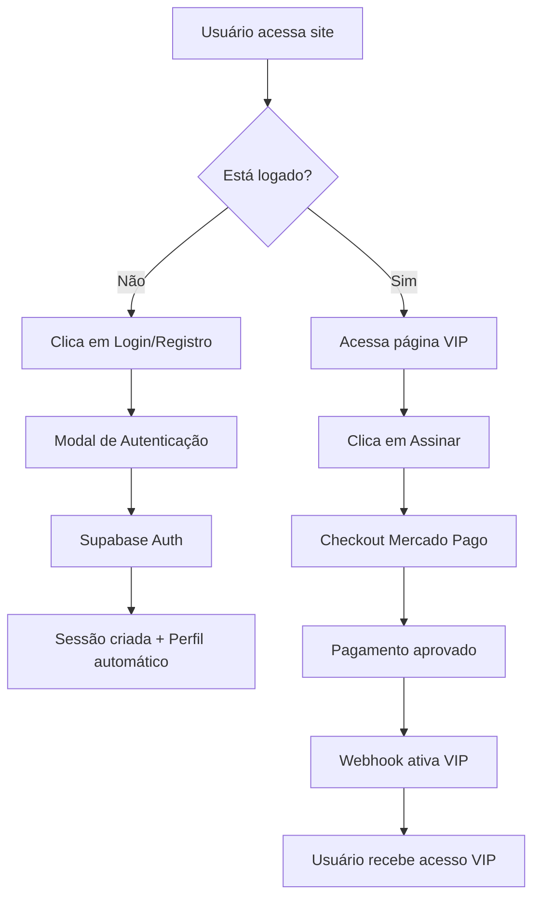

# Implementação Completa: Sistema de Autenticação e VIP com Supabase

## ✅ Implementação Concluída

### 🗄️ 1. Configuração do Banco de Dados Supabase

#### Scripts SQL Criados:
- **`database/supabase-setup.sql`**: Configuração completa das tabelas
- **`database/rls-policies.sql`**: Políticas de Row Level Security

#### Tabelas Implementadas:
- **`profiles`**: Perfis de usuário com campos VIP
- **`vip_payments`**: Histórico detalhado de pagamentos  
- **`usuarios_vip`**: Compatibilidade com sistema existente

#### Recursos Automáticos:
- **Triggers**: Ativação automática de VIP após pagamento
- **Funções**: Criação automática de perfil no registro
- **RLS**: Isolamento total de dados entre usuários

### 🔐 2. Sistema de Autenticação Completo

#### Componentes Criados:
- **`components/ui/auth-form.tsx`**: Formulário unificado (login/registro/reset)
- **`components/ui/auth-modal.tsx`**: Modal responsivo com hooks
- **`app/auth/login/page.tsx`**: Página dedicada de autenticação

#### Funcionalidades:
- ✅ **Login/Registro** com validação em tempo real
- ✅ **Reset de senha** via email
- ✅ **Sessão persistente** integrada ao Supabase
- ✅ **Redirecionamentos inteligentes** após login
- ✅ **Tratamento robusto de erros** com mensagens amigáveis

### 💳 3. Integração Pagamento → VIP Automática

#### Webhook Atualizado (`app/api/webhook/mercado_pago/route.js`):
- ✅ **Validação de segurança** (headers, tokens)
- ✅ **Prevenção de duplicatas** (verificação de pagamentos existentes)
- ✅ **Ativação automática** de VIP no Supabase
- ✅ **Logging detalhado** para debugging
- ✅ **Tratamento de erros** robusto

#### Checkout Integrado (`app/api/checkout/route.js`):
- ✅ **Validação de usuário logado**
- ✅ **Associação pagamento ↔ usuário**
- ✅ **Metadata completa** (userId, email, planType)
- ✅ **URLs de retorno** personalizadas

### 🎯 4. Fluxo de Usuário Implementado



## 🔧 Configuração Necessária

### 1. Executar Scripts SQL no Supabase:
```bash
# No SQL Editor do Supabase:
1. Execute: database/supabase-setup.sql
2. Execute: database/rls-policies.sql
```

### 2. Configurar Variáveis de Ambiente:
```bash
# Copie o template:
cp .env.local.example .env.local

# Configure com suas credenciais:
SUPABASE_URL=https://your-project.supabase.co
SUPABASE_SERVICE_ROLE_KEY=your_service_role_key
MERCADO_PAGO_TOKEN=your_access_token
JWT_SECRET=your_secure_secret
WEBHOOK_BASE_URL=https://your-domain.com  # ou tunnel para dev
```

### 3. Configurar Webhook no Mercado Pago:
```
URL: https://your-domain.com/api/webhook/mercado_pago
Eventos: Pagamentos (payment)
```

## 🎨 Componentes de UI

### AuthForm
- Formulário unificado para login/registro/reset
- Validação em tempo real
- Estados de loading
- Mensagens de erro/sucesso

### AuthModal  
- Modal responsivo com backdrop
- Hook personalizado para controle
- Redirecionamentos automáticos
- Fechamento com Escape

### Página de Login Dedicada
- `/auth/login` para experiência completa
- Suporte a parâmetros de redirecionamento
- Interface limpa e profissional

## 📊 Funcionalidades de Segurança

### Row Level Security (RLS)
- Usuários veem apenas seus próprios dados
- Service role para operações administrativas
- Funções SECURITY DEFINER para operações controladas

### Validação de Webhook
- Verificação de headers de segurança
- Validação de origem do Mercado Pago
- Prevenção de ataques de replay

### Tratamento de Erros
- Logs detalhados para debugging
- Mensagens user-friendly
- Fallbacks para falhas temporárias

## 🚀 Como Usar

### Para Desenvolvedores:
```tsx
import { useAuthModal } from '../components/ui/auth-modal'

function Component() {
  const { openLogin, openRegister, AuthModal } = useAuthModal()
  
  return (
    <>
      <button onClick={() => openLogin({ redirectTo: '/vip' })}>
        Login
      </button>
      <AuthModal />
    </>
  )
}
```

### Para Usuários:
1. **Acesse o site** → Clique em "Login/Cadastrar"
2. **Crie sua conta** → Confirme email (se necessário)
3. **Faça login** → Acesse página VIP
4. **Assine VIP** → Redirecionado para Mercado Pago
5. **Pague** → VIP ativado automaticamente
6. **Acesse conteúdo VIP** → Disponível imediatamente

## ⚡ Próximos Passos

### Opcional (Melhorias Futuras):
1. **Testes automatizados** para o fluxo completo
2. **Email templates** personalizados no Supabase
3. **Dashboard admin** para gerenciar VIPs
4. **Notificações push** para renovações
5. **Analytics** de conversão login → VIP

## 🐛 Debugging

### Logs Importantes:
```bash
# Webhook do Mercado Pago:
console.log('🔔 Webhook recebido')
console.log('👤 Usuário encontrado:', profileData.id)
console.log('✅ VIP ativado até:', vipExpiresAt)

# Autenticação:
console.log('🔐 Auth state changed:', event, session?.user?.email)
console.log('📊 Status VIP:', vipStatus)
```

### Verificação Manual:
1. **Supabase**: Tabelas `profiles`, `vip_payments`, `usuarios_vip`
2. **Mercado Pago**: Dashboard de transações
3. **Browser**: Application > Local Storage > Auth token

## ✨ Resultado Final

O sistema agora oferece uma experiência completa e integrada:
- **Registro/Login** simplificado e seguro
- **Checkout** conectado ao usuário logado  
- **Ativação VIP** 100% automática
- **Sessão persistente** entre visitas
- **Interface moderna** e responsiva
- **Segurança robusta** com RLS e validações

Todos os componentes trabalham em harmonia para garantir que o usuário tenha uma jornada fluida desde o cadastro até o acesso VIP completo.